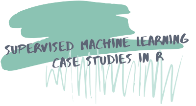

# Welcome to the course repo for **Supervised Machine Learning: Case Studies in R**! 🎉 
ou can access [this course for free online](linkylink).

This course approaches supervised machine learning using:

- [tidyverse](https://tidyverse.tidyverse.org/) tools
- tmore mature parts of he [tidymodels](https://github.com/tidymodels) suite of packages
- [caret](https://topepo.github.io/caret/)

The interactive course site is built on the amazing framework created by [Ines Montani](https://ines.io/), originally built for her [spaCy course](https://course.spacy.io).  The front-end is powered by
[Gatsby](http://gatsbyjs.org/) and [Reveal.js](https://revealjs.com) and the
back-end code execution uses [Binder](https://mybinder.org). [Florencia D'Andrea](https://florencia.netlify.com/) helped port the course materials and made the fun logo.

To learn more about building a course on this framework, see Ines's starter repos for making courses in [Python](https://github.com/ines/course-starter-python) and [R](https://github.com/ines/course-starter-r), and her explanation of how the framework works at [the original course repo](https://github.com/ines/spacy-course#-faq).

Te course material in this course is licensed [CC-BY-SA](https://creativecommons.org/licenses/by-sa/4.0/), meaning you are free to use it, change it, and remix it as long as you give appropriate credit and distribute any new materials under the same license.  The _code_ is [MIT](https://opensource.org/licenses/MIT)-licensed.

